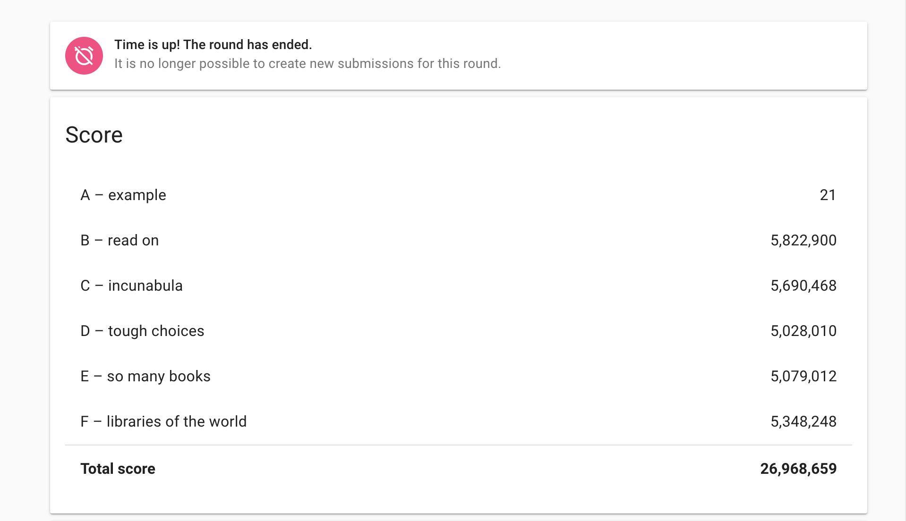
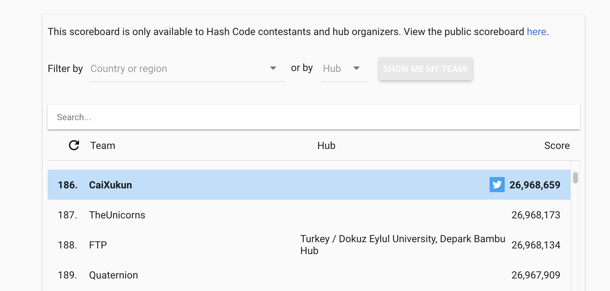
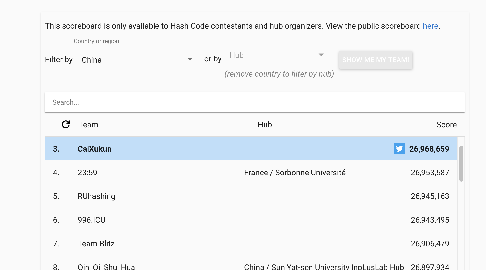

# Google Hash Code 2020
Hash Code is a team programming competition, organized by Google, for students and professionals around the world. The official link is [this](https://codingcompetitions.withgoogle.com/hashcode). I participated in the online qualification round of hash code 2020 and I think the question is quite interesting. I put my solution here. If you have better ideas, please let me know. 

My final result is here!
| Problem  | Score |
| ------------- | ------------- |
| A  | 21       |
| B  | 5822900  |
| C  | 5690468  |
| D  | 5030545  |
| E  | 5079012  |
| F  | 5348248  |
(I got better result on the problem D after the extend round ending.)
My final global and local rank is here!

## Method
This problem obviously is a set covering problem which find the best answer is NP complete.
I use greedy method and probabilistic method to fine tuning. 

## specific method for each problem

Here are my ideas for these problem.
1.  First problem is quite easy and we can easily found a solution that all valuable books can be shipped. And the final score is 21=1+2+3+4+5+6.
2.  Second problem is not too difficult, we can observe that all libraries have 1000 books and can only send 1 book per day. All books have the same value,100. What is more important, every book exists in only one library. Considering that all libraries can not send over books, So the answer is clearly, we only need to continually select the library whose sign up days is shortest.
3.  As we can see, for all libraries, it can ship all books in single day. We can achieve local optimization by continually selecting the library whose gain/(number of sign up days) is biggest.
4.  We can observe the following:
    $$ 
    N_i<=14, T_i=1, M_i=1,S_i=65
    $$
    $$
    Sum(N_i)=220800>78600=B
    $$
    We only need to continually select the library whose gain is maximuim.n The sum value of books is 5109000.

5. The obvious feature of problem e is that it can only ship at most 1/10 books.

the global best answers of problem a and problem b are founded. As for problem d, the sum value of books is 5109000 which our result 5030545 is quite close to.

## Story behind this
I and a classmate in collage took participate in this competition. We got up in midnight and tried our best to solve problems. When I was coding, I realized that it may can be solved by greedy method. But my code capacity was quite poor and didn't make it. We finally got score of 18768231. I learned the importance of module thinking and the importance of coding ability. 
